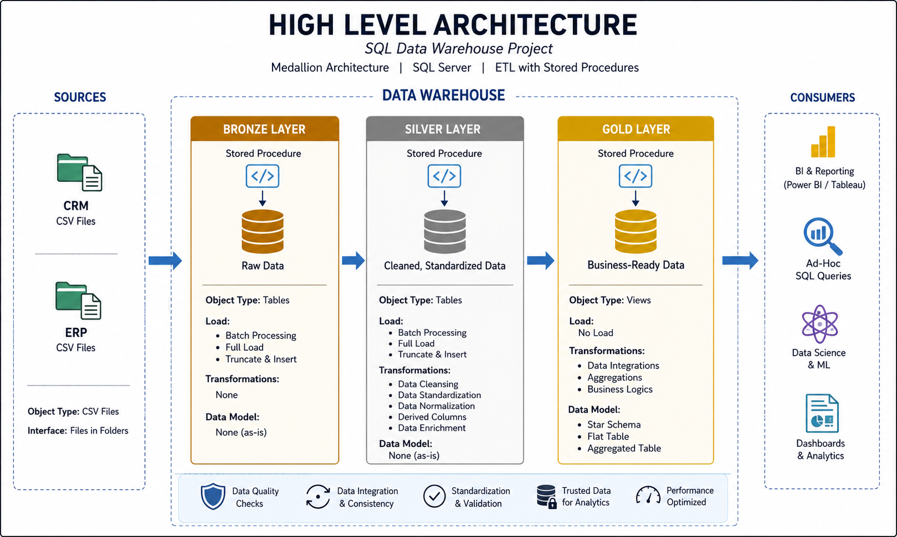

# SQL Data Warehouse Project

## 📖 Project Overview

This project focuses on building an end-to-end data warehouse in SQL Server using sales data collected from multiple source systems.

The goal is to take raw ERP and CRM datasets, clean and integrate them, build an analytics-ready data model, and use SQL to generate useful business insights.

Through this project, I implemented the main stages of a typical data engineering workflow, including data ingestion, transformation, data quality checks, dimensional modeling, and analytical querying.

---

## 🏗️ Data Architecture

The warehouse follows a Medallion Architecture with three layers:

### Bronze Layer

The Bronze layer stores the original source data with minimal changes.

CSV files from the ERP and CRM systems are loaded into SQL Server so the raw source data is preserved.

### Silver Layer

The Silver layer contains cleaned and standardized data.

In this stage, I handle tasks such as:

- correcting inconsistent values
- handling missing data
- removing duplicates
- standardizing formats
- validating data quality
- combining related data from different source systems

### Gold Layer

The Gold layer contains business-ready datasets designed for reporting and analytics.

The cleaned data is organized using a dimensional model with fact and dimension tables so analytical queries can be performed efficiently.

---

## 🗺️ High-Level Architecture



---

## 🚀 Project Workflow

The project covers the following areas:

### Data Ingestion

Import raw ERP and CRM data from CSV files into SQL Server.

### ETL Processing

Extract the source data, transform it through cleaning and standardization, and load the processed data into the appropriate warehouse layers.

### Data Quality

Validate the datasets and resolve issues such as duplicate records, incorrect values, inconsistent formats, and missing information.

### Data Modeling

Create dimension and fact tables and organize them into a star schema suitable for analytics.

### Data Analysis

Use SQL queries to analyze the final datasets and identify useful patterns, trends, and business metrics.

---

## 📋 Business Requirements

The data warehouse is designed to consolidate sales information from two source systems:

- ERP
- CRM

The main requirements are:

- integrate data from multiple source systems into one analytical model
- clean and standardize the incoming data
- provide reliable datasets for reporting and analysis
- focus on the latest available data
- document the warehouse structure and data flow

Historical tracking is outside the current project scope.

---

## 📊 Analytics

The final warehouse supports analysis in areas such as:

### Customer Analysis

Understand customer activity, purchasing behavior, and contribution to overall sales.

### Product Analysis

Evaluate product performance and identify high-performing and low-performing products.

### Sales Analysis

Analyze sales performance, order activity, revenue trends, and changes over time.

---

## 🛠️ Technologies Used

- SQL Server
- SQL Server Management Studio (SSMS)
- T-SQL
- CSV datasets
- Git
- GitHub

---

## 📂 Repository Structure

```text
data-warehouse-project/
│
├── datasets/
│   └── Raw ERP and CRM source files
│
├── docs/
│   └── Architecture, data flow, data model, and supporting documentation
│
├── scripts/
│   ├── bronze/
│   ├── silver/
│   └── gold/
│
├── tests/
│   └── Data quality and validation queries
│
└── README.md
```
---

## 🎯 What I Learned

This project helped me gain practical experience with:

SQL development
data warehouse architecture
ETL pipelines
data cleaning
data integration
dimensional modeling
fact and dimension tables
star schemas
data quality validation
analytical SQL
organizing a data engineering project using GitHub

---

## 🎯 Project Goal

The main goal of this project is to demonstrate how raw data from different operational systems can be transformed into a structured data warehouse that supports reliable reporting, analytics, and business decision-making.

---


## 🙌 Acknowledgment

This project was developed as a hands-on learning project to strengthen my practical understanding of SQL data warehousing.

I implemented and practiced data warehouse architecture, SQL development, ETL, data quality, dimensional modeling, and analytical data preparation throughout the project.
